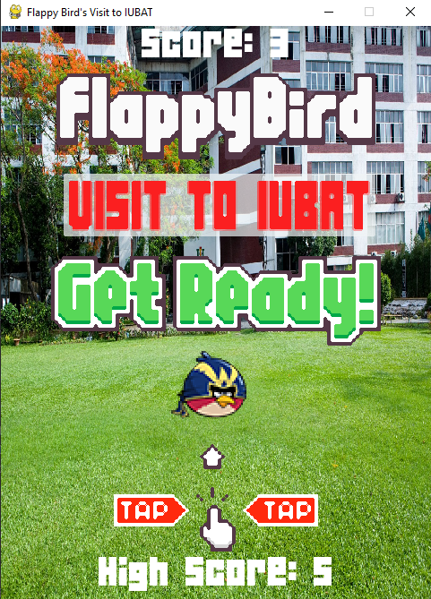

# Flappy-Birds-Visit-to-IUBAT

## Description:
This is a Flappy Bird game made in python using pygame.

## How to play
1. Install Python 3.8.X from [here](https://www.python.org/downloads/)
2. Install PyGame 2.0.X from [here](https://pypi.org/project/pygame/)
3. Clone this repository: `git clone https://github.com/iam-hasibul/Flappy-Birds-Visit-to-IUBAT` or click `Download ZIP` in the right panel and extract it.
4. Run `python main.py` from the repo's directory
5. Use Space to jump. Enjoy playing!

## Screenshots

## Contribution
If you have any ideas to make the game better, feel free to contribute!